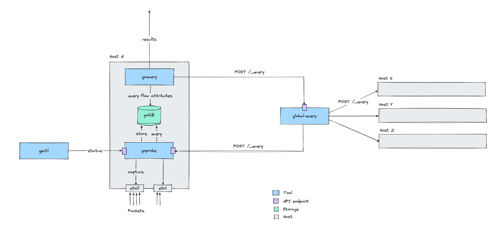

# goProbe

[](https://github.com/els0r/goProbe/releases)
[](https://godoc.org/github.com/els0r/goProbe/)
[](https://goreportcard.com/report/github.com/els0r/goProbe)
[](https://github.com/els0r/goProbe/actions?query=workflow%3AGo)
[](https://github.com/els0r/goProbe/actions/workflows/codeql.yml)

This package comprises:

* [goProbe](./cmd/goProbe/) - A high-througput, lightweight, concurrent, network packet aggregator
* [goDB](./pkg/goDB/) - A small, high-performance, columnar database for flow data (pkg)
* [goQuery](./cmd/goQuery/) - CLI tool for high-performance querying of goDB flow data acquired by goProbe
* [gpctl](./cmd/gpctl/) - CLI tool to interact with a running goProbe instance (for status and capture configuration)

Conversion tools:

* [goConvert](./cmd/goConvert/) - Helper binary to convert goProbe-flow data stored in `csv` files
* [legacy](./cmd/legacy/) - DB conversion tool to convert `.gpf` files - needed for upgrade to a `v4.x` compatible format

As the name suggests, all components are written in [Go](https://golang.org/).

## Migrating to Version 4

There are breaking changes for:

* the database format
* goProbe's configuration file format
* goProbe's API endpoints
* the JSON results format from `goQuery`

To convert your existing pre-v4 DB to a `v4.x` compatible format, please refer to the [legacy](./cmd/legacy) conversion tool.

## Introduction

Today, targeted analyses of network traffic patterns have become increasingly difficult due to the sheer amount of traffic encountered. To enable them, traffic needs to be captured and examined and broken down to key descriptors which yield a condensed explanation of the underlying data.

The [NetFlow](http://www.ietf.org/rfc/rfc3954.txt) standard was introduced to address this reduction. It uses the concept of flows, which combine packets based on a set of shared packet attributes. NetFlow information is usually captured on one device and collected in a central database on another device. Several software probes are available, implementing NetFlow exporters and collectors.

goProbe deviates from traditional NetFlow as flow capturing and collection is run on the same device and the flow fields reduced. It was designed as a lightweight, standalone system, providing both optimized low-footprint packet capture and a storage backend tailored to the flow data in order to provide lightning-fast analysis queries.

## Quick Start

Refer to the Releases section to install the software suite.

To start capturing, configure [goProbe](./cmd/goProbe/). To query data produced by it, run [goQuery](./cmd/goQuery/). To query across a fleet of hosts, deploy [global-query](./cmd/global-query/).



## goDB

The database is a columnar block-storage. The raw attribute data is captured in `.gpf` (goProbe file) files.

`goDB` is a package which can be imported by other `go` applications.

### The `.gpf` File Structure

The database has two built-in partition dimensions: interfaces and time. These were chosen with the goal to drastically reduce the amount of data that has to be loaded during querying. In practice, most analyses are narrowed down to a time frame and a particular interface.

Time partitioning is done in two steps: per day, and within the files, per five minute intervals. The location of flow data for these intervals is specified (amongst other properties) in the `.meta` files.

#### `.meta` file

The `.meta` file can be thought of as a partition-index and a layout for how the data is stored. Next to storing the timestamps and positions of blocks of flow data, it also captures which compression algorithm was used and provides sizing information for block decompression.

The `.meta` files are vitally important and - if deleted, corrupted or modified in any way - will result in failed data reading for the *day* of data.

#### Compression

`goDB` natively supports compression. The design rationale was to sacrifice CPU cycles in order to decrease I/O load. This has proven to drastically increase performance, especially on queries involving several days and a high number of stored flow records. 

Supported compression algorithms are:

* [lz4](https://github.com/lz4/lz4)
* [zstd](https://github.com/facebook/zstd)
* None (not recommended)

Check [encoder.go](./pkg/goDB/encoder/encoder.go) for the enumeration of supported compression algorithms and the definition fo the `Encoder` interface. Compression features are available by linking against system-level libraries (`liblz4` and `libzstd`, respectively), so those must be available at runtime (and consequently their development libraries are required if the project is build from source).

### Ingesting Flow data from CSV

If you use `goConvert`, you need to make sure that the data which you are importing is _temporally ordered_ and provides a column which stores UNIX timestamps. An example `csv` file may look as follows:

```sh
# HEADER: bytes_rcvd,bytes_sent,dip,dport,packets_rcvd,packets_sent,proto,sip,tstamp
...
40,72,172.23.34.171,8080,1,1,6,10.11.72.28,1392997558
40,72,172.23.34.171,49362,1,1,6,10.11.72.28,1392999058
...
```

You *must* abide by this structure, otherwise the conversion will fail.

### Bash autocompletion

`goQuery` has extensive support for bash autocompletion. To enable autocompletion, you need to tell bash that it should use the `goquery_completion` program for completing `goquery` commands.  How to do this depends on your distribution. On Debian derivatives, it is recommended to create a file `goquery` in `/etc/bash_completion.d` with the following contents:

```bash
_goquery() {
    case "$3" in
        -d) # the -d flag specifies the database directory.
            # we rely on bash's builtin directory completion.
            COMPREPLY=( $( compgen -d -- "$2" ) )
        ;;

        *)
            if [ -x /usr/local/share/goquery_completion ]; then
                mapfile -t COMPREPLY < <( /usr/local/share/goquery_completion bash "${COMP_POINT}" "${COMP_LINE}" )
            fi
        ;;
    esac
}
```

### Supported Operating Systems

goProbe is currently set up to run on Linux based systems only (this might change in the future). Tested versions include (but are most likely not limited to):

* Debian >= 7.0 `[=> liblz4-1,libzstd1]`
* Fedora >= 28 `[=> lz4-libs,libzstd]`
* Ubuntu >= 14.04 `[=> liblz4-1,libzstd1]`
* Alpine >= 3.14 `[=> lz4-dev,zstd-dev]`

## Authors & Contributors

* Lennart Elsen
* Fabian Kohn
* Lorenz Breidenbach

This software was initially developed at [Open Systems AG](https://www.open.ch/) in close collaboration with the [Distributed Computing Group](http://www.disco.ethz.ch/) at the [Swiss Federal Institute of Technology](https://www.ethz.ch/en.html).

This repository has been forked off the Open Systems repository end of 2018 and has now been detached as a standalone project (September 2020). Bug fixes and development of new features is done in this repository.

It has undergone an almost complete re-write with version 4 in 2023.

## Bug Reports & Feature Requests

Please use the [issue tracker](https://github.com/els0r/goProbe/issues) for bugs and feature requests (or any other matter).

## License

See the [LICENSE](./LICENSE) file for usage conditions.
